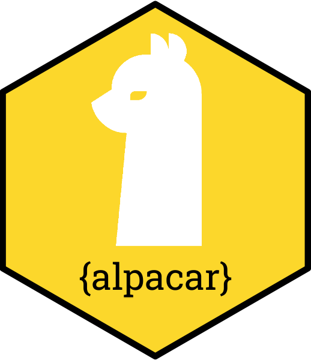

<!-- 🚨 README.md is generated from README.Rmd. Please edit that file -->

```{r setup, include=FALSE}
knitr::opts_chunk$set(comment = NA)
```

# emayili 

<!-- badges: start -->
[](https://cran.r-project.org/package=alpacar)

[](https://app.codecov.io/gh/datawookie/alpacar)
[](https://lifecycle.r-lib.org/articles/stages.html)
<!-- badges: end -->

`{alpacar}` is an R package wrapper for the [Alpaca](https://alpaca.markets/) API.

API documentation can be found [here](https://docs.alpaca.markets/docs/).

## Installation

Install from GitHub.

```r
remotes::install_github("datawookie/alpacar")
```

## Load

Once installed you can load the package. I also like to increase the number of significant figures in `tibble` output (completely optional).

```r
  library(alpacar)
  
  # Expand decimal places.
  options(pillar.sigfig = 8)
```

## Authenticate

I store my credentials in environment variables. Specifically I use a `.env` file in my project directory.

```r
library(dotenv)

load_dot_env()

authenticate(
  key = Sys.getenv("ALPACA_KEY"),
  secret = Sys.getenv("ALPACA_SECRET_KEY")
)
```
